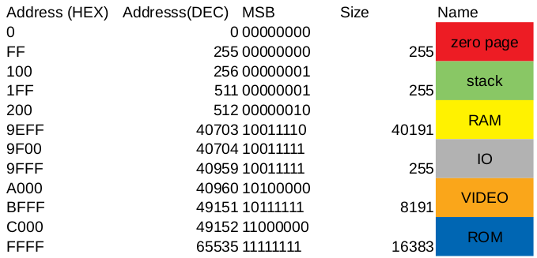

# 6502-sbc

This repository is about 6502 single board computer. It contains :

* WD6502
* RAM - AS6C1008-55N, 128K
* ROM - AT28C256, 32K
* IO (VIA) - WD65C22
* SERIAL (ACIA) - WD65C51

*I would like to thinks the 6502 team for the amazing job they did, and all people that hobby possible.*
*In memory of Chuck Paddle.*

## PCB

You can found schematics and PCB [here](https://easyeda.com/gignops/6502-computer)

## Memory mapping

Equations :

* CS_RAM =!CS_ROM & !CS_IO & !CS_CHAR & !CS_INDEX & !CS_COLOR
* CS_IO = A15 & A12 & A11 & A10 & A9 & A8
* CS_VIDEO = A15 & A13
* CS_ROM = A15 & A14

* CS_CHAR = CS_VIDEO & !A12 & !A11
* CS_INDEX = CS_VIDEO & !A12 & A11
* CS_COLOR = CS_VIDEO & A12 & !A11

